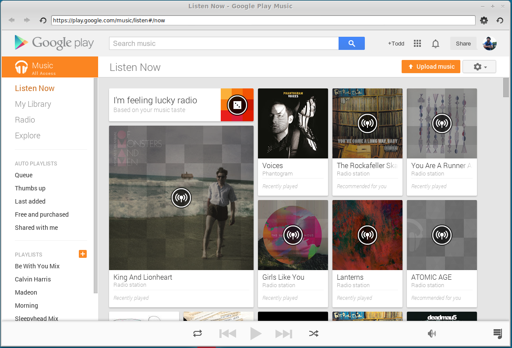

# kindle-webkit

Thin wrapper around [Kindle Cloud Reader][] via [node-webkit][]

**THIS PROJECT HAS BEEN ABANDONED DUE TO AMAZON'S MANIFEST STATING IT DISLIKES `node-webkit` AND CHANGING THE USER AGENT DOESN'T FIX IT -_-;;**

**Features:**

- Kindle as a standalone application on Linux

[Kindle Cloud Reader]: https://read.amazon.com/
[node-webkit]: https://github.com/rogerwang/node-webkit

## Requirements
- [node-webkit][]
- [npm][], usually installed with [node][]

[npm]: http://npmjs.org/
[node]: http://nodejs.org/

## Getting Started
In a shell, run the following commands:

```bash
# Clone the repository
git clone https://github.com/twolfson/kindle-webkit
cd kindle-webkit

# Start the application via `node-webkit`
nw .
```

When the application has launched, it can be shown/hidden via its tray icon, .



#### Running without a terminal
For running `kindle-webkit` without a terminal, start via `screen`. Once it has launched, the terminal can be closed without exiting the application.

```bash
screen nw .
```

##### Gnome installation
If you are on Gnome/Cinnamon, you can use `./install-gnome.sh` to add the application to your menu.

```bash
./install-gnome.sh
# Kindle Webkit successfully installed!
```

## Contributing
In lieu of a formal styleguide, take care to maintain the existing coding style. Add unit tests for any new or changed functionality. Lint via [grunt](https://github.com/gruntjs/grunt) and test via `npm test`.

## Donating
Support this project and [others by twolfson][gittip] via [gittip][].

[![Support via Gittip][gittip-badge]][gittip]

[gittip-badge]: https://rawgithub.com/twolfson/gittip-badge/master/dist/gittip.png
[gittip]: https://www.gittip.com/twolfson/

## Unlicense
As of May 02 2014, Todd Wolfson has released this repository and its contents to the public domain, excluding that which has been attributed to other sources.

It has been released under the [UNLICENSE][].

[UNLICENSE]: UNLICENSE
